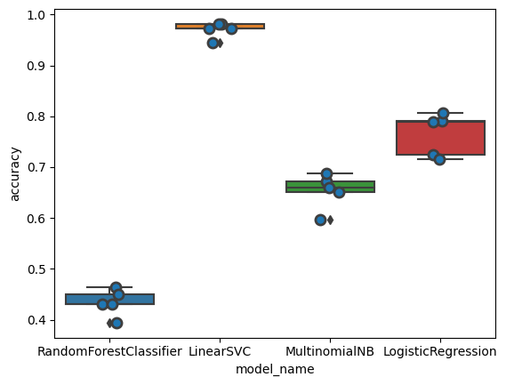

# NLP-Project

## Objective

Train a model that can recognize a certain label by reading a text.

## Installation

For running these programs we recommend Python 3.9.13 and you can run this to install all the necessary libraries:
- 'pip install -r requirement.txt'

If you have problems with the FrenchLefffLemmatizer use this line in your terminal:
- 'pip install git+https://github.com/ClaudeCoulombe/FrenchLefffLemmatizer.git'

## Aug_data.ipynb

This file is for augmenting the data if you have few data. The more data you have the better the model will perform.

It needs the input of the file you want to augment.
It needs 2 inputs from that file: the texts and the labels.
Then it will save a new file with the augmented data.

## Preprocess.ipynb

This file does all the preprocessing of the data to get the most out of the model.

## svc_model.ipynb

### Model selection:

We compared different machine learning models which are as follows:

1. Random forest classifier
2. Linear SVC
3. MultinomialNB
4. Logistic regression

This is the result of the different models in a graph:

Based on the evaluation metrics (Mean accuracy & Standard deviation), we decided to use Linear SVC model.

Model evaluation :

We used classification report to evaluate our model (Accuracy = 0.91 for Linear SVC)

## streamlit_app.py

To run the streamlit_app.py file just use the following command in the terminal:
- 'streamlit run streamlit_app.py'

This file is used to make the model run online so that it can easily be utilized with a appropriate interface.

## Authors of this project

* [Stefan Mihut](https://github.com/StefanMihut)
* [Chaitali Sonawane](https://github.com/Chaitali1290)
* [Jorg Vervaet](https://github.com/JorgVervaet)

